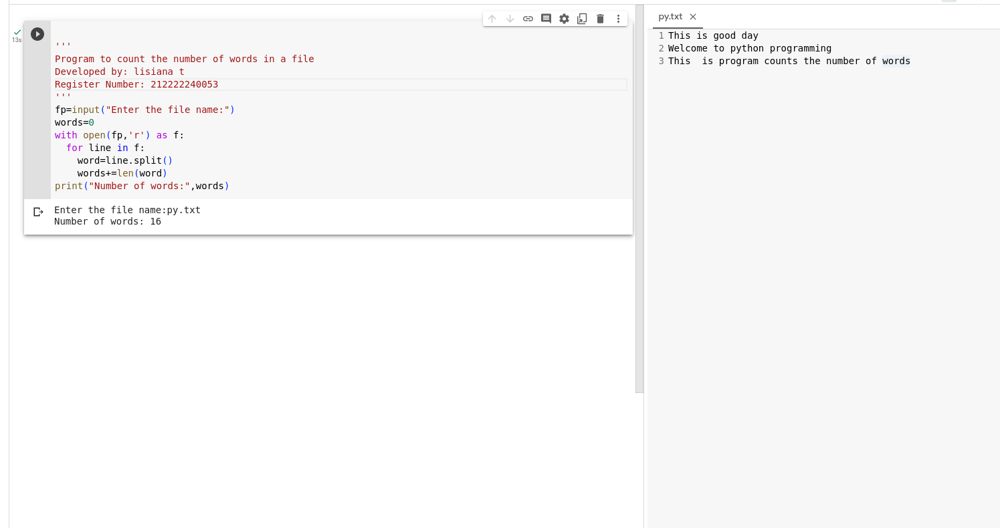

# Word-count
## AIM:
To write a python program for getting the word count from a text.
## EQUIPEMENT'S REQUIRED: 
PC
Anaconda - Python 3.7
## ALGORITHM: 
### Step 1:

Get the input as file name from the user.

### Step 2: 

assign number of words = 0

### Step 3: 

open file and read it.

### Step 4:  

split the words separately by using split(

### Step 5: 

calculate the sum of the words in file

### Step 6: 

Print the number of words.

## PROGRAM:
```

'''
Program to count the number of words in a file
Developed by: lisiana t
Register Number: 212222240053

fp=input("Enter the file name:")
words=0
with open(fp,'r') as f:
  for line in f:
    word=line.split()
    words+=len(word)
print("Number of words:",words)

```

## OUTPUT



## RESULT:
Thus the program is written to find the word count from a text.
